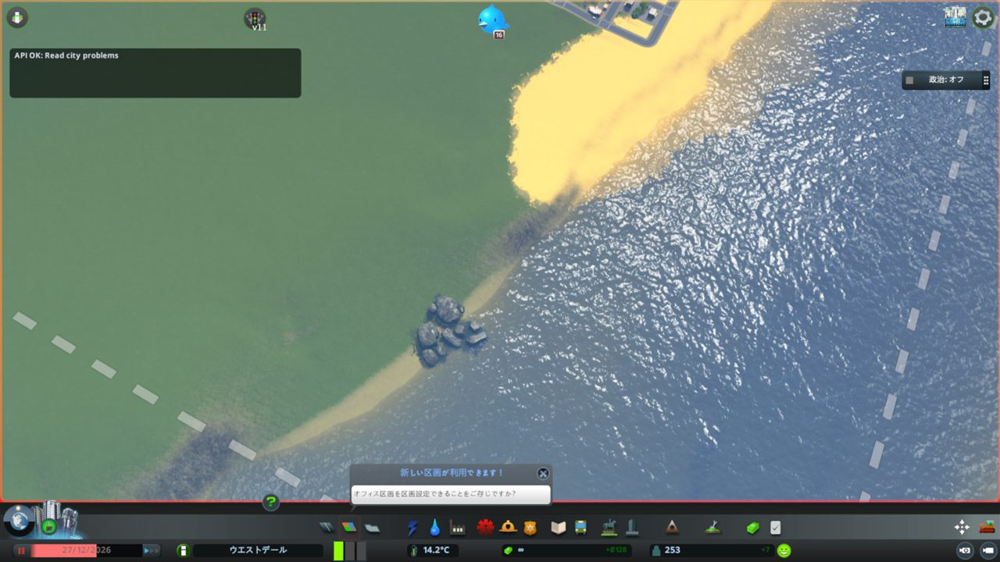
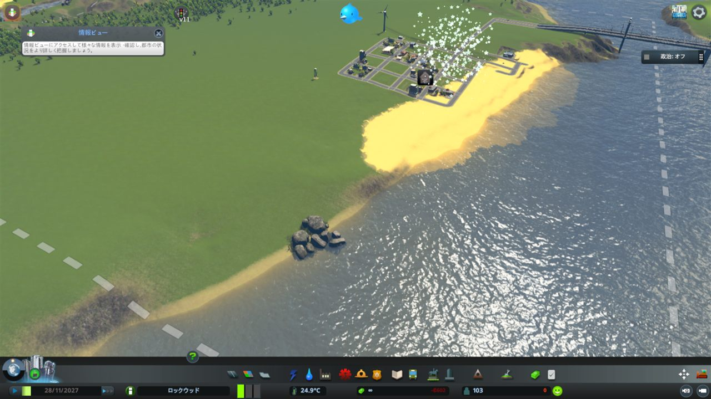

# CodexにCities: Skylinesの都市建設をやらせてみた！ AI市長が「村」を爆誕させる実験

Cities: Skylines 1を起動して、あとはAIエージェントが勝手に都市を設計し、道路を引き、インフラを整え、問題が起きたら直し、最後に保存する。

そんなことをやりたくて、`cities-skylines1-agent-skill` を作りました。

2026年5月12日、この実験の様子をXでリアルタイムに公開しました。投稿者はSunwood AI LabsのMaki（[@hAru_mAki_ch](https://x.com/hAru_mAki_ch)）です。

やったことはかなりシンプルで、かなり無茶です。

- 使用ゲーム: Cities: Skylines 1、いわゆるクラシック版
- 手法: 独自MODを自作し、Codexがゲーム内操作をAPI経由で自律実行
- 目標: 道路整備、外部接続、水道、電力、下水まで人間が触らず最低限の都市機能を作る
- 結果: AI市長による「村」が爆誕。ただし、一部水没などの味わい深い事故も残りました

リポジトリはこちらです。

https://github.com/Sunwood-ai-labs/cities-skylines1-agent-skill



## Xでのリアルタイム進行

今回の実験は、3部構成のような形で進みました。

### 1. まずは独自MOD作成

最初に作ったのは、AIがCities: Skylines 1を操作するための独自MODです。

グリッド状の道路と建物を置けるところまで作り、Codex側からAPIを叩いてゲーム内の状態を変えられるようにしました。この時点で「AIが画面を見てクリックする」のではなく、「AIがゲーム内部のAPIを呼んで建設する」方向性が固まりました。

投稿: https://x.com/hAru_mAki_ch/status/2054120325798154502

### 2. 道路整備、外部接続、水道、電気まで進む

次の段階では、道路を拡張し、外部道路と接続し、風力発電所や水道、電気インフラを置いていきました。

夜の街並みの中で、AIエージェントがAPIを叩きながら道路とインフラを伸ばしていく様子はなかなか面白いです。もちろん、まだ水没エリアが目立つなど、都市計画としては荒削りです。でも、人間が直接操作せずにここまで形になるのはかなり手応えがありました。

投稿: https://x.com/hAru_mAki_ch/status/2054139409679974643

### 3. 最低限の都市インフラが完成

最後は、水道、電力、下水などの主要インフラがひとまず揃い、最低限機能する「村」として成立するところまで到達しました。

このときの感想は、ほぼこれです。

> なんとか最低限の都市のインフラ設置までエージェントだけで行けたぞ！！
> AI市長による村爆誕

投稿: https://x.com/hAru_mAki_ch/status/2054162622531227837

ここから先は、単に一度だけ村を作る話ではありません。問題が出たらAPIで調べ、道路を削除し、作り直し、保存し、また続きを開けるようにする。そこまで含めて、AI市長の実験です。

## 何を作ったのか

これは Cities: Skylines 1 向けのMOD兼Codex Skillです。

MOD側はゲーム内でローカルHTTP APIを立ち上げます。エージェント側はスクリーンショットを見て雰囲気でクリックするのではなく、`http://127.0.0.1:32123` にAPIリクエストを投げて、都市の状態取得や建設操作を行います。

たとえば、こんなことができます。

- 都市の人口、資金、問題アイコン、施設数を取得する
- 道路、水道管、暖房管、電線の状態を取得する
- 道路の未接続、近すぎるノード、短すぎるセグメントを検出する
- 建物が道路上に乗っている、道路から離れすぎている、といった配置異常を検出する
- 道路や配管を作る
- 建物を置く、移動する、削除する
- ゾーンを塗る
- シミュレーション速度を変える
- セーブする
- API実行内容をゲーム画面に通知する



## なぜ画像認識だけではだめだったのか

最初は、画面を見ながら操作できれば十分に思えます。

しかし、実際に都市を作らせてみるとすぐに限界が出ました。

水滴アイコン、電気不足、道路未接続、施設不足のような情報は、画面の見た目だけでは安定して読めません。カメラ角度、UI表示、ズーム、ポップアップ、翻訳、画質の影響を強く受けます。

さらに問題なのは、見た目では接続されているように見える道路や配管が、ゲーム内部では接続されていないことです。Cities: Skylinesのネットワークは、セグメントが交差しているだけでは接続になりません。ノードを共有して初めて接続です。

つまり、AIに都市開発を任せるなら、画像ではなくゲーム内部のデータを取る必要があります。

## APIで都市を操作する

作ったMODは、CS1のゲーム内から状態を読み、HTTP APIとして返します。

主な取得APIは次のようなものです。

```text
GET /state/summary
GET /state/problems
GET /state/facilities
GET /state/networks
GET /state/road-anomalies
GET /state/building-anomalies
GET /state/saves
GET /prefabs/roads
GET /prefabs/buildings
```

操作APIは、あえて小さく分けています。

```text
POST /commands/build-network
POST /commands/place-building
POST /commands/move-building
POST /commands/bulldoze
POST /commands/set-zone
POST /commands/set-simulation-speed
POST /commands/save
```

一括実行用に `POST /commands/batch` もありますが、基本はおまけです。都市開発エージェントに必要なのは、巨大な「全部いい感じに直す」コマンドではなく、小さく、観測可能で、やり直せる操作です。

## 汎用性は「分離されたコマンド」から生まれる

途中でかなり大事な設計変更がありました。

最初は、問題を見つけたら一発で修復する便利APIを増やしたくなります。たとえば「道路異常を修復する」APIです。

でも、それでは汎用性がありません。

実際の都市では、エージェントがやりたいことは毎回少しずつ違います。

- この道路だけ削除したい
- 削除したあと、同じ場所ではなく少しずらして作り直したい
- 配管は残したい
- 施設は移動したい
- 高速道路との接続だけを優先したい
- いまは保存だけしたい

そこで、APIはできるだけ分離しました。

道路がおかしければ、まず `GET /state/road-anomalies` で調べます。悪いセグメントを `POST /commands/bulldoze` で消します。そのあと `POST /commands/build-network` で必要な道路を作ります。最後に `GET /state/road-anomalies` をもう一度見て、問題が減ったか確認します。

この流れなら、エージェントの判断を後から追えます。失敗しても、どの操作で崩れたかが分かります。

## 実際に踏んだ問題

作ってすぐ、いろいろ壊れました。

道路が孤立して、住民が街に入ってこない。小学校が道路の上に置かれる。下水処理施設やボイラーが水没気味の場所に置かれる。配管が見た目では交差しているのに接続していない。古いセーブを開いてしまう。保存できていない。ゲーム内で `Array index is out of range` が出る。

この手の問題は、AIの計画能力だけでは直りません。必要なのは、エージェントが自分で検査できる観測点です。

そこで、次のようなAPIを増やしました。

- `/state/road-anomalies`
- `/state/building-anomalies`
- `/state/facilities`
- `/state/networks`
- `/state/saves`

道路異常は、道路ネットワークのノードやセグメントを見て検出します。建物異常は、施設の位置と近くの道路との距離を見ます。保存はAPIで実行し、ファイルが本当に作られたかも確認します。

## ゲーム画面にも通知を出す

APIだけで操作していると、ゲーム画面を見ている人間には何が起きているのか分かりません。

そこで、APIが実行されるたびに、ゲーム画面左上へ短い通知を出すようにしました。

たとえば、道路を作った、施設を置いた、保存した、問題を検査した、という操作がゲーム側でも見えます。

これは地味ですが、かなり重要です。AIエージェントが裏で都市を触るなら、人間が「いま何をしているか」を把握できることは信頼につながります。

## Codex Skillとしての使い方

このリポジトリは、単なるMODではなくCodex Skillとしても使えるようにしています。

`SKILL.md` には、エージェントが守るべきルールを書いています。

- 画像認識よりAPI状態を優先する
- 既存セーブはResumeして修復する
- 新規マップはユーザーが明示したときだけ始める
- コマンドは分離して実行する
- 重要な変更のあとには保存する
- 保存ファイルが存在することを確認する

これにより、エージェントは毎回ゼロから都市を作り直すのではなく、現在の都市を検査し、悪いところだけを直し、継続して開発できます。

## いまの到達点

現時点では、AIエージェントがCities: Skylines 1をAPI経由で触るための土台ができました。

スターター都市を作り、道路やインフラを配置し、問題を検出し、必要に応じて削除や再配置を行い、保存するところまで動いています。Xで公開した時点では「AI市長による村爆誕」と呼べるくらいには、最低限の都市インフラが揃いました。

もちろん、まだ実験段階です。地形や水面、既存道路との接続、施設の向き、サービス範囲、交通量、予算、マイルストーン解放など、都市としてちゃんと育てるには見るべきものがまだたくさんあります。

ただ、方向性ははっきりしました。

AIにゲームを操作させるなら、画面をクリックさせるだけでは足りません。ゲーム内部の意味をAPIにして、エージェントが観測、判断、実行、検証、保存を回せるようにする必要があります。

Cities: Skylines 1は、その実験にかなり良い題材です。

## 次にやりたいこと

次は、都市開発ループをさらに賢くしたいです。

- 需要メーター、予算、税率、幸福度、交通量のAPI化
- 公共サービスのカバレッジ評価
- 水没、急斜面、道路貫通のより厳密な検出
- 高速道路接続を優先する道路計画
- 施設配置前の候補地スコアリング
- 変更前後の差分レポート
- 長時間自律開発用のエージェントプロンプト

最終的には「都市を育てて」と言うだけで、エージェントが現在の都市を読み、必要なAPIを叩き、失敗したら修復し、節目ごとに保存していくところまで持っていきたいです。

MOD自体はOSSとして展開していきます。Cities: Skylinesファンだけでなく、AIエージェント、ゲームMOD、自動化、自律システムに興味がある人にも触ってもらえる形に育てたいです。

## まとめ

今回作った `cities-skylines1-agent-skill` は、Cities: Skylines 1をAIエージェントの実験場にするための橋です。

ポイントはシンプルです。

- 画像認識ではなくAPIで都市状態を読む
- 巨大な自動修復ではなく、小さな汎用コマンドを組み合わせる
- 実行内容をゲーム画面にも通知する
- 保存までAPI化して、作業を継続できるようにする
- Codex Skillとして、エージェントが同じ作法で都市を扱えるようにする

ゲームMODとしても、AIエージェント基盤としても、かなり面白い入口になりました。

情報元: 2026年5月12日に投稿したMaki（[@hAru_mAki_ch](https://x.com/hAru_mAki_ch)）のXスレッド。
